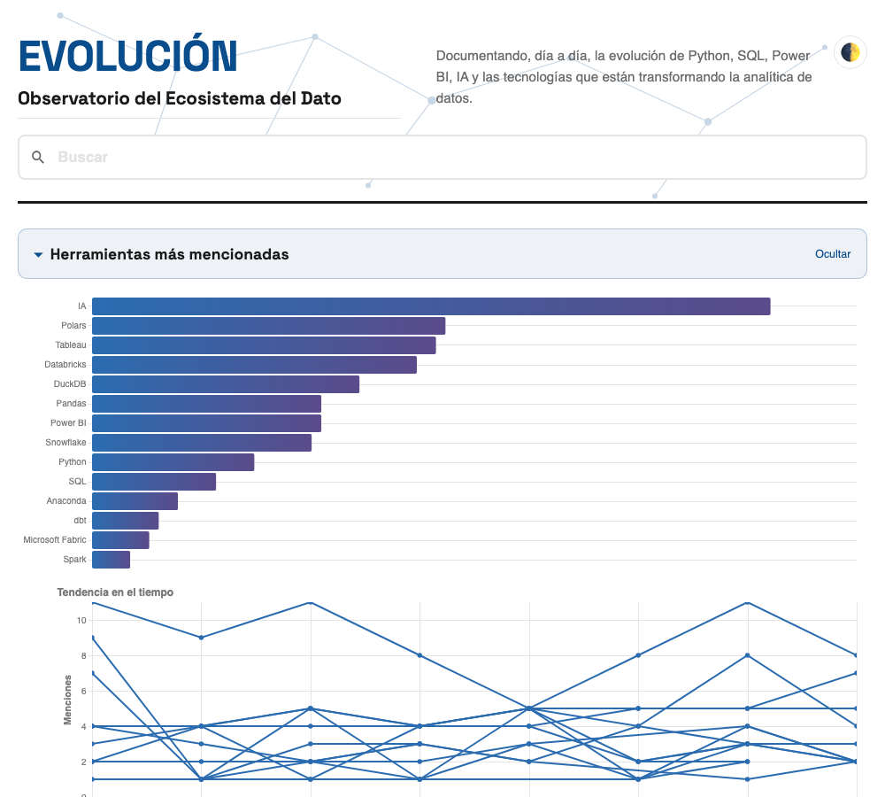
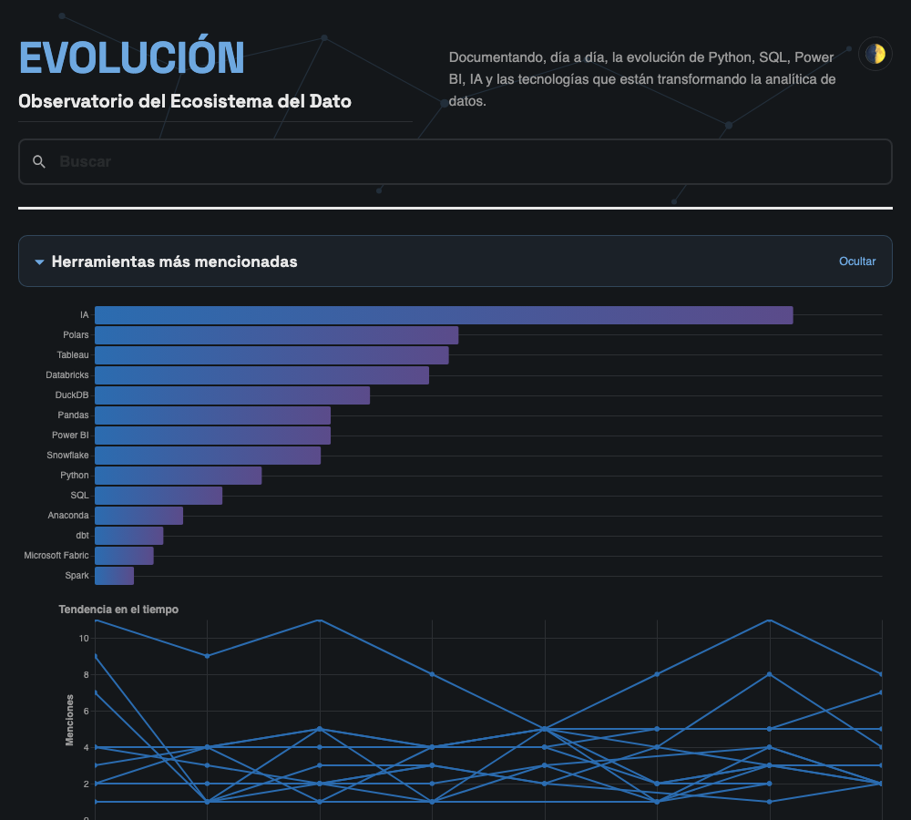

<div align="center">

# EVOLUCIÓN

**Observatorio del Ecosistema del Dato**

[](https://alexandra-caceres-ayala.github.io/evolucion/)


</div>

---

EVOLUCIÓN es un proyecto editorial que documenta, día a día, la evolución del ecosistema del dato en español.

Cada edición se construye a partir de fuentes oficiales, documentación técnica y medios especializados para crear un archivo histórico sobre Data Analytics, Business Intelligence e Inteligencia Artificial aplicada al dato.

El proyecto sigue una filosofía sencilla: escribir una sola vez, automatizar la publicación y conservar cada edición como parte de un archivo permanente, mantenible y preparado para evolucionar con el proyecto.

## 🧭 Filosofía

- Una única fuente de verdad: Markdown.
- Análisis de tendencias del ecosistema mediante visualización interactiva (pandas + Altair).
- Automatización del proceso de recolección, limpieza y publicación.
- Arquitectura simple, mantenible y sin dependencias de plataformas propietarias.
- Información respaldada por enlaces a las fuentes originales.

---

## ⚙️ Arquitectura

El proyecto está diseñado como un pipeline de datos: cada edición pasa por las mismas cuatro etapas, de forma automática y reproducible.

```text
📥  Recolección
    boletín diario en Markdown, con fuente citada en cada noticia
      ↓
🧹  Limpieza y estructuración
    Python: extracción de etiquetas, normalización del texto
      ↓
📊  Análisis y visualización
    pandas + Altair: menciones por herramienta, tendencia en el tiempo,
    gráfico interactivo
      ↓
🚀  Publicación automática
    Jinja2 + GitHub Actions + GitHub Pages: sitio estático, sin pasos manuales
```

---

## 🖼️ Vista previa

<div align="center">


</div>

*Ranking de menciones y tendencia en el tiempo por herramienta, construido con pandas y Altair: interactivo (clic para resaltar una herramienta, zoom sobre el eje de fechas) y adaptado a modo claro/oscuro.*

---

## 🗂️ Estructura del proyecto

```
boletines-crudos/   boletines diarios tal como se generan cada mañana (fuente de verdad)
boletines-fijos/    contenido escrito a mano (p. ej. el anuncio de bienvenida)
boletines/          generado por importar_boletin.py — no editar a mano
templates/          plantillas Jinja2 (HTML)
static/             CSS, JS e imágenes del sitio
scripts/            importar_boletin.py · generate_site.py · subir_boletin_github.py · generar_portada_linkedin.py
docs/               salida generada, servida por GitHub Pages — no editar a mano
```

---

## 📤 Cómo se publica

El ciclo diario es automático de extremo a extremo — no hay `git push` local ni pasos manuales:

1. **Cada mañana a las 11:00**, un agente programado con `launchd` (el programador nativo de macOS) genera el boletín del día con IA en modo desatendido, siguiendo una plantilla editorial estricta (secciones, filtro temático y fuente oficial obligatoria en cada noticia).
2. El mismo agente lo sube a `boletines-crudos/` mediante la **API de GitHub** (`scripts/subir_boletin_github.py`) — idempotente: si un día quedó pendiente, la siguiente corrida se pone al día sola.
3. **GitHub Actions** (`.github/workflows/deploy.yml`) se dispara con el cambio: corre `importar_boletin.py` (traduce el crudo al formato con frontmatter) y `generate_site.py` (construye `docs/` entero: HTML, buscador, gráfico de tendencias, sitemap, RSS, imagen Open Graph).
4. Publica `docs/` en GitHub Pages.

Además, cada semana se publica un **resumen en LinkedIn** ([suscríbete aquí](https://www.linkedin.com/build-relation/newsletter-follow?entityUrn=7485707534079672322)), con su portada de marca generada por `scripts/generar_portada_linkedin.py`.

---

## ☕ Apoya el proyecto

Si EVOLUCIÓN te aporta valor, puedes apoyarlo en [Ko-fi](https://ko-fi.com/evolucion) — cada aporte ayuda a dedicarle el tiempo y el cuidado que merece. ✦

---

## 💻 Desarrollo local (solo para previsualizar, no para publicar)

```bash
python3 -m venv venv
source venv/bin/activate
pip install -r requirements.txt

python3 scripts/importar_boletin.py   # trae boletines nuevos a boletines/
python3 scripts/generate_site.py       # construye docs/
python3 -m http.server 8934 --directory docs   # previsualizar en localhost:8934
```
